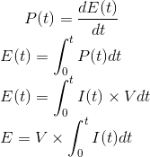

Procedure for power profiling RE-Mote
=====================================

Different configurations of radio and sensors
---------------------------------------------

For accessing and using the source code for this project, from gitlab:

``` shell
$ git clone https://gitlab.com/satvam/contiki
$ cd contiki 

$ git checkout power-profile
$ cd examples/udp-ipv6
$ vim project-conf.h
  # edit the first four lines as per your need

$ sudo make PORT=<dev tty port> udp-server.upload login
  # replace the <dev tty port> with the port you want to upload the code to

```

These different configurations should be tested:

1. Radio 
   ```c
      #define RDC         0     /* radio-off */
      #define RDC         1     /* radio-contikimac */
      #define RDC         2     /* radio-nullrdc */
   ```

2. Transmission
   ```c
      #define TRANSMIT_ON  0    /* transmit off */
      #define TRANSMIT_ON  1    /* transmit on */
   ```

3. Sensor
   ```c
      #define SENSOR_ON    0    /* sensor off  */
      #define SENSOR_ON    1    /* sensor on */
      /* note, just disabling this macro may not do
       * You must also physically disconnect the sensor
       */
   ```

4. Computation
   ```c
      #define COMPUTE_ON   0    /* switch off computation */
      #define COMPUTE_OFF  1    /* switch on computation  */
   ```

Equipment for current measurements
----------------------------------

1. Current measuring probe: Tektronics TCPA300 - 1x
2. Tektronics TCPA300 current amplifier        - 1x
2. Tektronics 5100 series oscilloscope         - 1x
3. Tekprobe interface cable                    - 1x
3. Zolertia RE-Motes (Rev A and Rev B)         - 2x
4. AlphaSense SO_2 sensor                      - 1x
5. GWINSTEK GPS-2303 DC power supply box       - 1x
6. Male-Female jumpers                         - 2x
7. Female-Female jumpers                       - 4x
8. Bread board                                 - 1x

Using the DSO and current probe (Tektronics)
--------------------------------------------

1. For setting up the current probe:
    - connect the current probe output to the current amplifier
    - connect the current amplifier to DSO output
      [CAUTION: make sure the DSO channel has load resistance of 50ohms]
    - Start up the DSO and the current amplifier.
    - Close the current probe if notified by the amplifier indicators. (PROBE OPEN)
    - Press PROBE DEGAUSS AUTOBALANCE, to set DC offset to 0
      [CAUTION: make sure the current probe is not connected to any circuit]
    - The DC offset should now be zero, showing that the current probe is 
      de-Gaussed

2. Powering up the RE-Mote:
    - Use GWINSTEK power supply box and draw 2 wires from 0-30V output.
    - Set voltage to 3.3V
    - Short the two wires and adjust current to 0.03A
    - Connect the two leads to a bread-board.
    - Draw two male-female jumpers from these location on the bread-board
      and connect them to BAT and GND of RE-Mote.
    [NOTE: You can verify if the device is powered up by burning border-router
        code on the other RE-Mote and check if data is being transmitted.]

3. Taking measurements:
    - [CAUTION: Use the current probe only after autobalancing or measurements
          will be erroneous]
    - Open the current probe by sliding the switch on it's body.
    - Place the wire, going to the device, in the loop, taking care that the 
      arrow points to the direction of flowing current. 
      [CAUTION: Do this before powering the device]
    - Measure the current waveform on the DSO
      [NOTE: You may want to adjust scaling in X and Y]

4. Saving the waveform:
    - Stop the waveform by pressing Run/Stop button on the DSO
    - Adjust the cursor positions to cover the full width of the data
    - Click on File menu
    - Under Select for Export choose Waveform(data)
    - Now again click on File and then Export
    - Save the dat file in a convenient location.
    
Computing energy from the readings
----------------------------------

Energy consumed by an electric circuit is the integral of the power consumption with respect to time.



Thus we integrate the current (find the area under the curve) and multiply it with the constant DC supply voltage.
    
